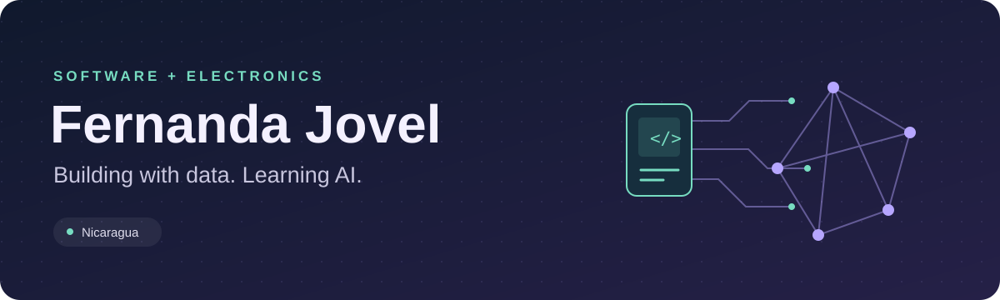

  

  
  

## Hey, I'm Fernanda 👋

I build applications and electronics prototypes that connect **software, data, and the physical world**. I'm studying Cybernetic Electronics Engineering at **Universidad Tecnológica La Salle, Nicaragua**, and learning **AI and data science through GCI World**.

My favorite kind of challenge is making hardware and software work together.

## ✨ Selected work

<table>
  <tr>
    <td width="50%" valign="top">
      <h3>💧 Water quality monitor</h3>
      
An irrigation water monitoring prototype that measures pH, temperature, and dissolved solids, with automatic pump control and a live dashboard.

      
<b>My work:</b> ESP32 firmware, MQTT integration, and the Django dashboard. Challenges included correcting temperature-compensated EC-to-TDS conversion and working toward more stable readings from low-cost sensors.

      
<code>ESP32</code> <code>C++</code> <code>Django</code> <code>MQTT</code>

      
<a href="https://github.com/ferjovel06/water-quality-dashboard">Dashboard →</a> · <a href="https://github.com/ferjovel06/water-quality-firmware">Firmware →</a>

    </td>
    <td width="50%" valign="top">
      <h3>🌱 Agrifos</h3>
      
Agricultural software for soil diagnostics and fertilization planning.

      
<b>My work:</b> implementing the application and backend, including sensor data, access permissions, and agronomic calculation rules.

      
<code>Flutter</code> <code>FastAPI</code> <code>PostgreSQL</code>

      
<a href="https://github.com/ferjovel06/Agrifos-Pre-Hackathon">Explore Agrifos →</a>

    </td>
  </tr>
  <tr>
    <td width="50%" valign="top">
      <h3>🐝 Quibee</h3>
      
An educational desktop app with interactive lessons, exercises, and local progress tracking.

      
<b>My work:</b> implementing the interface, lesson interactions, and data persistence.

      
<code>C#</code> <code>Avalonia</code> <code>SQLite</code>

      
<a href="https://github.com/ferjovel06/Quibee">Explore Quibee →</a>

    </td>
    <td width="50%" valign="top">
      <h3>🧩 RCIU-Score</h3>
      
A research reference calculator with versioned scoring definitions and server-side calculation.

      
<b>My work:</b> translating the supplied scoring model into an application with validation, persistence, and software tests.

      
<code>React</code> <code>TypeScript</code> <code>Supabase</code>

      
<a href="https://github.com/ferjovel06/RCIU-Score">Explore RCIU-Score →</a>

    </td>
  </tr>
</table>

For Agrifos, Quibee, and RCIU-Score, my contribution is the software implementation; research and domain content were provided by collaborators.

## 🛠 What I build with

**Backend & data**

   

**Apps & interfaces**

   

**Hardware & environment**

   

  
More tools I've used

  Java · Spring Boot · JavaScript · HTML/CSS · MySQL · SQLite · Git · Arduino · NixOS

## 🌱 Currently learning

At GCI World, I'm working with **NumPy, pandas, Matplotlib, and scikit-learn**, practicing data analysis, classification, cross-validation, and model evaluation.

I want to bring that learning into applications that work with real-world data, including data from sensors.

## 🌎 Beyond the code

- **Erasmus exchange:** HSBI, Bielefeld, Germany.
- **SUSI for Young Women Leaders:** University of Arizona, USA.
- **National Hackathon Nicaragua 2022:** regional phase winner with my team.
- **National Hackathon Nicaragua 2026:** building Agrifos for the upcoming competition.
- **Languages:** Spanish and English.

## 📊 GitHub activity

  
  

Software · electronics · learning AI

---

**Let's build something useful.** [Find me on LinkedIn →](https://www.linkedin.com/in/maria-fernanda-jovel/)
